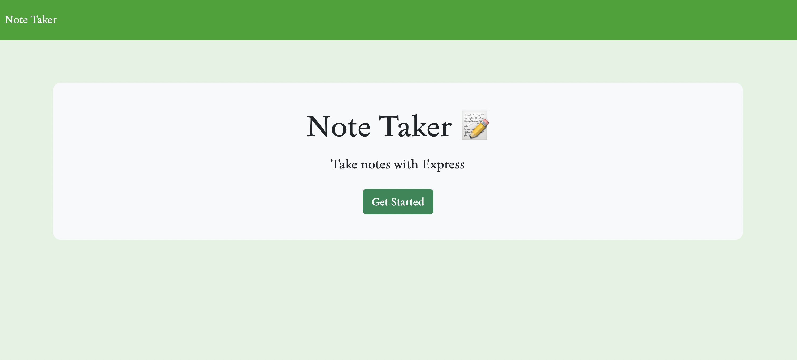
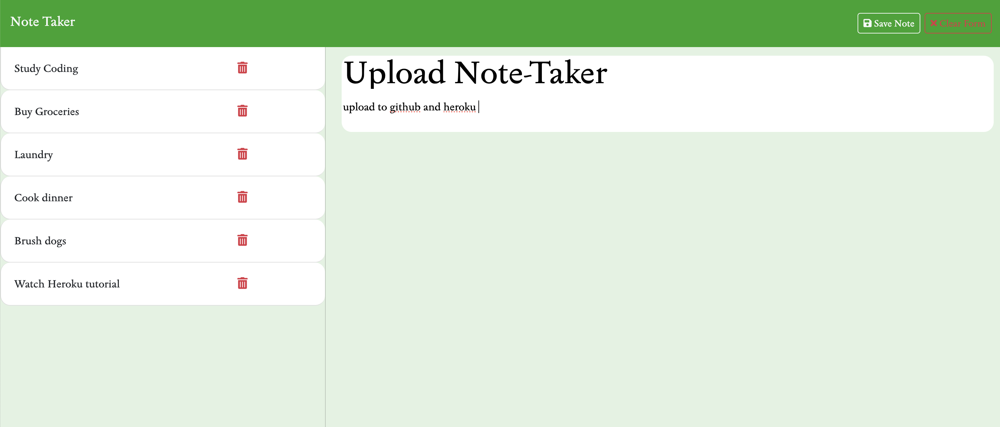

# Note-taker 
Module 11 Challenge using express.js 

### Github : [Click this link!](github.com/sandyvzqz/note-taker)
### Heroku : [Deployed App link](https://note-taker-expressjs-app-f8c7b6cab7b8.herokuapp.com/)

## Description 
This application allows users to write, save, and delete notes using Express.js. The front end of this project was provided, but the back end functionality had to be created in order to make a fully functioning app. Using routers allowed for the backend of the application to be linked to the frontend, and vice versa. Some of the node libraries that were used for this project included: express, file system, uuid(a random id generator), and nodemon. Other technologies like JSON allowed data to be read/written in order to be viewed, saved, or deleted. 

## Usage
- To use this application, clone the github repository linked above. 
- Once the repository is cloned, open it in VS Code.
- Right click 'server.js' file, and open it in the integrated terminal.
- Next, run 'npm install' to install all dependencies the app requires.
- Lastly, start the app by running 'node server.js' in the terminal.
- Go to 'localhost:3001' in your preferred browser, and use the app!

## Screenshots
Below are some screenshots displaying the completed application.

## Contributions
The following articles helped me with developing the backend functionality of this project. 
- [W3Schools Async/Await](https://www.w3schools.com/js/js_async.asp)
- [FreeCodeCamp Async/Await](https://www.freecodecamp.org/news/javascript-async-await/)
- [NpmDocs UUID](https://www.npmjs.com/package/uuid)
- [Express.js routing](https://expressjs.com/en/guide/routing.html)
- [Express.js middleware](https://expressjs.com/en/guide/using-middleware.html)

